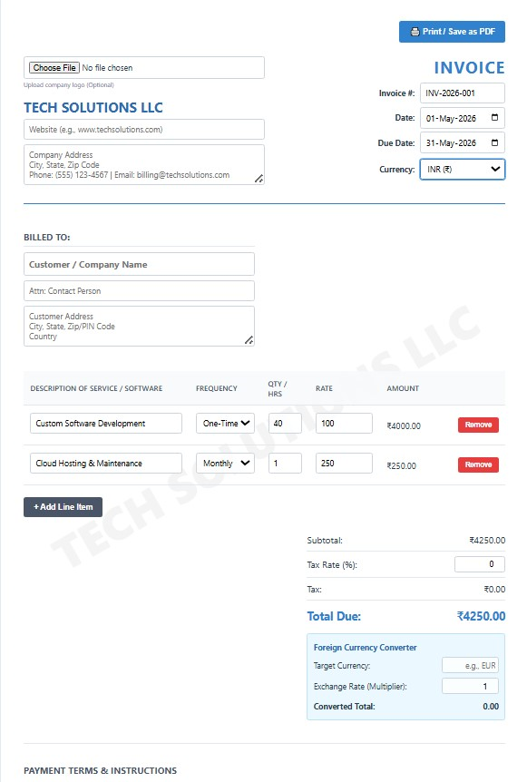

# Advanced Software Invoice Generator

A professional, interactive, and fully client-side invoice generator built specifically for software agencies, freelancers, and tech companies. This tool allows you to easily input project details, calculate totals, convert currencies, and generate a clean, print-ready PDF directly from your web browser.



## ✨ Features

* **Custom Branding:** Upload your company logo directly from your computer. The generator automatically creates a faded, diagonal background watermark using your company name and logo.
* **Dynamic Line Items:** Easily add or remove services. The app automatically calculates subtotals, custom tax rates, and the grand total in real-time.
* **Billing Frequencies:** Specify whether a service is billed as *One-Time*, *Monthly*, or *Yearly* (perfect for mixing development costs with SaaS or hosting retainers).
* **Multi-Currency Support:** Instantly swap the currency symbol across the entire invoice ($, €, £, ₹, ¥).
* **Foreign Currency Converter:** Built-in exchange rate calculator to show international clients their estimated total in their local currency.
* **Print-Optimized (Save as PDF):** Specialized CSS `@media print` rules ensure that all buttons, upload fields, and dropdown arrows disappear when you print, leaving a flawless, professional document.
* **Zero Dependencies:** 100% pure HTML, CSS, and vanilla JavaScript. No servers, databases, or npm packages required.

## 🚀 How to Use

1. **Clone the repository:**
   ```bash
   git clone [https://github.com/yourusername/software-invoice-generator.git](https://github.com/yourusername/software-invoice-generator.git)